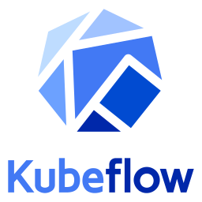

# Kubeflow

## What is Kubeflow

[Kubeflow](https://www.kubeflow.org/) is the foundation of tools for AI Platforms on Kubernetes.

AI platform teams can build on top of Kubeflow by using each project independently or deploying the
entire AI reference platform to meet their specific needs. The Kubeflow AI reference platform is
composable, modular, portable, and scalable, backed by an ecosystem of Kubernetes-native
projects that cover every stage of the [AI lifecycle](https://www.kubeflow.org/docs/started/architecture/#kubeflow-projects-in-the-ai-lifecycle).

Whether you’re an AI practitioner, a platform administrator, or a team of developers, Kubeflow
offers modular, scalable, and extensible tools to support your AI use cases.

Please refer to [the official documentation](https://www.kubeflow.org/docs/) for more information.

## What are Kubeflow Projects

Kubeflow is composed of multiple open source projects that address different aspects
of the AI lifecycle. These projects are designed to be usable both independently and as part of the
Kubeflow AI reference platform. This provides flexibility for users who may not need the full
end-to-end AI platform capabilities but want to leverage specific functionalities, such as model
training or model serving.

| Kubeflow Project                                                                    | Source Code                                                             |
| ----------------------------------------------------------------------------------- | ----------------------------------------------------------------------- |
| [KServe](https://www.kubeflow.org/docs/external-add-ons/kserve/)                    | [`kserve/kserve`](https://github.com/kserve/kserve)                     |
| [Kubeflow Katib](https://www.kubeflow.org/docs/components/katib/)                   | [`kubeflow/katib`](https://github.com/kubeflow/katib)                   |
| [Kubeflow Model Registry](https://www.kubeflow.org/docs/components/model-registry/) | [`kubeflow/model-registry`](https://github.com/kubeflow/model-registry) |
| [Kubeflow Notebooks](https://www.kubeflow.org/docs/components/notebooks/)           | [`kubeflow/notebooks`](https://github.com/kubeflow/notebooks)           |
| [Kubeflow Pipelines](https://www.kubeflow.org/docs/components/pipelines/)           | [`kubeflow/pipelines`](https://github.com/kubeflow/pipelines)           |
| [Kubeflow SDK](https://github.com/kubeflow/sdk)                                     | [`kubeflow/sdk`](https://github.com/kubeflow/sdk)                       |
| [Kubeflow Spark Operator](https://www.kubeflow.org/docs/components/spark-operator/) | [`kubeflow/spark-operator`](https://github.com/kubeflow/spark-operator) |
| [Kubeflow Trainer](https://www.kubeflow.org/docs/components/trainer/)               | [`kubeflow/trainer`](https://github.com/kubeflow/trainer)               |

## What is the Kubeflow AI Reference Platform

The Kubeflow AI reference platform refers to the full suite of Kubeflow projects bundled together
with additional integration and management tools. Kubeflow AI reference platform deploys the
comprehensive toolkit for the entire AI lifecycle. The Kubeflow AI reference platform can be
installed via [Packaged Distributions](https://www.kubeflow.org/docs/started/installing-kubeflow/#packaged-distributions)
or [Kubeflow Manifests](https://www.kubeflow.org/docs/started/installing-kubeflow/#kubeflow-manifests).

| Kubeflow AI Reference Platform Tool                                                                 | Source Code                                                   |
| --------------------------------------------------------------------------------------------------- | ------------------------------------------------------------- |
| [Central Dashboard](https://www.kubeflow.org/docs/components/central-dash/)                         | [`kubeflow/dashboard`](https://github.com/kubeflow/dashboard) |
| [Profile Controller](https://www.kubeflow.org/docs/components/central-dash/profiles/)               | [`kubeflow/dashboard`](https://github.com/kubeflow/dashboard) |
| [Kubeflow Manifests](https://www.kubeflow.org/docs/started/installing-kubeflow/#kubeflow-manifests) | [`kubeflow/manifests`](https://github.com/kubeflow/manifests) |

## Kubeflow Community

Kubeflow is a community-led project maintained by the
[Kubeflow Working Groups](https://www.kubeflow.org/docs/about/governance/#4-working-groups)
under the guidance of the [Kubeflow Steering Committee](https://www.kubeflow.org/docs/about/governance/#2-kubeflow-steering-committee-ksc).

We encourage you to learn about the [Kubeflow Community](https://www.kubeflow.org/docs/about/community/)
and how to [contribute](https://www.kubeflow.org/docs/about/contributing/) to the project!
