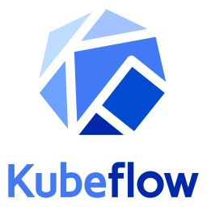

# Kubeflow

## What is Kubeflow

[Kubeflow](https://www.kubeflow.org/) is the foundation of tools for AI Platforms on Kubernetes.

AI platform teams can build on top of Kubeflow by using each subproject independently or deploying
the entire Kubeflow Community Distribution to meet their specific needs.
The Kubeflow Community Distribution is composable, modular, portable, and scalable, backed by an
ecosystem of Kubernetes-native projects that cover every stage of
[the AI lifecycle](https://www.kubeflow.org/docs/started/architecture/#kubeflow-projects-in-the-ai-lifecycle).

Whether you’re an AI practitioner, a platform administrator, or a team of developers,
Kubeflow offers modular, scalable, and extensible tools to support your AI use cases.

Kubeflow consists of Kubeflow Subprojects, Kubeflow Ecosystem, Kubeflow Packaged Distribution,
and Kubeflow Community Distribution.

Check out [the official documentation](https://www.kubeflow.org/docs/started/introduction/) for
more detailed information.

## Repository Role

This repository serves primarily as a gateway to Kubeflow subprojects and shared project metadata.
Kubeflow development happens in the individual subproject repositories.

## Kubeflow Community

Kubeflow is a community-led project maintained by the
[Kubeflow Working Groups](https://www.kubeflow.org/docs/about/governance/#4-working-groups)
under the guidance of the
[Kubeflow Outreach Committee](https://www.kubeflow.org/docs/about/governance/#3-kubeflow-outreach-committee),
[Kubeflow Distribution Committee](https://www.kubeflow.org/docs/about/governance/#4-kubeflow-distribution-committee),
and [Kubeflow Steering Committee](https://www.kubeflow.org/docs/about/governance/#2-kubeflow-steering-committee-ksc).

We encourage you to learn about the [Kubeflow Community](https://www.kubeflow.org/docs/about/community/)
and how to [contribute](https://www.kubeflow.org/docs/about/contributing/) to the project!
