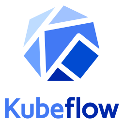

# Kubeflow

## What is Kubeflow

[Kubeflow](https://www.kubeflow.org/) is _the_ Cloud Native AI platform.

Kubeflow is composed of modular, open source projects that form the Kubernetes-native stack
for data & AI workloads. Whether you are an AI practitioner, a platform administrator, or a
decision-maker, Kubeflow offers modular, scalable, and extensible tools to support your
data, AI/ML, and HPC use-cases.

## Kubeflow Mission

Kubeflow's mission is to bridge the Data, AI, and Cloud Native ecosystems. We enable teams to
deliver more models, agents, and AI applications into production with well-lit paths across
[the AI lifecycle](/docs/started/architecture/#kubeflow-landscape-in-the-ai-lifecycle). By bringing
together the skills and expertise of an open global community, our goal is to be the standard for
data & AI workloads on Kubernetes.

The Kubeflow Community and Subprojects embrace the following core principles:

- **Simple**: Run workloads at any scale without becoming a Kubernetes expert
- **Portable**: Use the same code on a local laptop, on-premises, or in any cloud
- **Scalable**: Manage hyperscale training jobs and high-throughput AI agents
- **Composable**: Mix and match tools across the AI lifecycle

## Kubeflow Community

Kubeflow is a community-led project maintained by the
[Kubeflow Working Groups](https://www.kubeflow.org/docs/about/governance/#5-working-groups)
under the guidance of the
[Kubeflow Outreach Committee](https://www.kubeflow.org/docs/about/governance/#3-kubeflow-outreach-committee),
[Kubeflow Distribution Committee](https://www.kubeflow.org/docs/about/governance/#4-kubeflow-distribution-committee),
and [Kubeflow Steering Committee](https://www.kubeflow.org/docs/about/governance/#2-kubeflow-steering-committee).

We encourage you to learn about the [Kubeflow Community](https://www.kubeflow.org/docs/about/community/)
and how to [contribute](https://www.kubeflow.org/docs/about/contributing/) to the project!

## Repository Role

This repository serves primarily as a gateway to Kubeflow subprojects and shared project metadata.
Kubeflow development happens in the individual subproject repositories.
