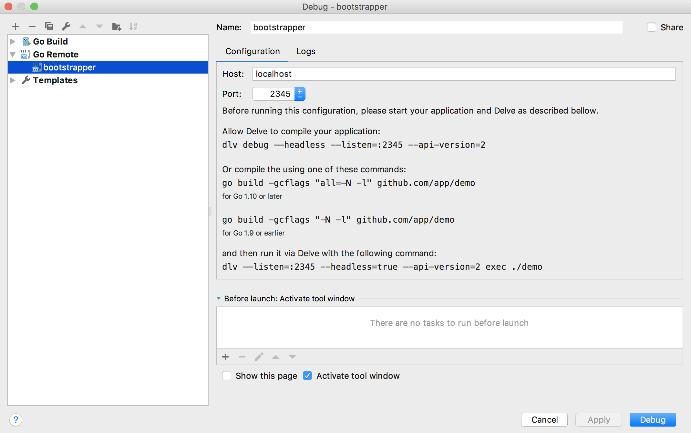

# Developer guide for bootstrap

## Building bootstrapper locally

Create a symbolic link inside your GOPATH to the location you checked out the code

```sh
mkdir -p ${GOPATH}/src/github.com/kubeflow
ln -sf ${GIT_KUBEFLOW} ${GOPATH}/src/github.com/kubeflow/kubeflow
```

* GIT_KUBEFLOW should be the location where you checked out https://github.com/kubeflow/kubeflow

### Prerequisites

golang to 1.11.2

```sh
$ ☞  go version
go version go1.11.2 darwin/amd64
```

On mac osx you can run 

```sh
brew upgrade golang
```

golang-1.11.2 uses go.mod, go.sum files which include dependencies.
To install a new dependency use `go get <dependency>`. 
golang-1.11.2 no longer creates a vendor directory.
You should add the environment variable `GO111MODULE=on` to your shell init file

### Makefile targets

```
build             debug             push              
build-local       debug-latest      push-latest       
cleanup           
```

#### `make build-local`
Creates bin/bootstrapper with full debug information

#### `make build` 
Depends on `make build-local`. Creates a docker image gcr.io/$(GCLOUD_PROJECT)/bootstrapper:$(TAG)

#### `make push` 
Depends on `make build`. Pushes the docker image gcr.io/$(GCLOUD_PROJECT)/bootstrapper:$(TAG)

#### `make push-latest` 
Depends on `make push`. Tags the docker image gcr.io/$(GCLOUD_PROJECT)/bootstrapper:$(TAG) with latest.
Note: To use a different gcloud project than kubeflow-images-public. 
```sh
export GCLOUD_PROJECT=mygcloudproject 
make push
```

#### `make debug` 
Depends on `make push` and `make cleanup`
1. deploys a Namespace, PersistentVolumeClaim and StatefulSet using $(IMG), $(TAG), $(PORT)
2. waits for pod kubeflow-bootstrapper-0 to be in phase 'Running'
3. runs "kubectl port-forward ..." in the background, opening port 2345 to the pod's container
4. wait - cleanup (kill port-forward command) on Ctrl-C
5. when the script exits (Ctrl-C) it will kill "kubectl port-forward ..." 
6. in order to clean up all resources deployed in step 1 run `make cleanup`

The StatefulSet will create a pod and start the following process in the pod's kubeflow-bootstrapper-0 container
```sh
/opt/kubeflow/dlv.sh
```
This script runs

```sh
dlv --listen=:2345 --headless=true --api-version=2 exec /opt/kubeflow/bootstrapper -- --in-cluster --namespace=kubeflow
```

[dlv](https://github.com/derekparker/delve) is a golang debugger that works with JetBrain's [Goland](https://www.jetbrains.com/go/)

In order to connect to the remote bootstrapper process, in goland add a "Go Remote" debug configuration like below

