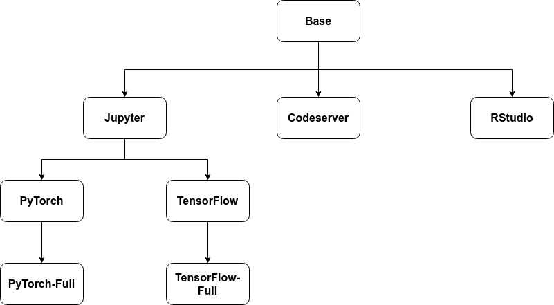

# Example Notebook Servers

**DISCLAIMER:** The Notebooks Working Group provides these Dockerfiles and
their images as examples only, they are not tested with our CI/CD pipelines
and are not certified to work in every situation. As such, issues related to
these images will be dealt with in a best efforts approach. The Notebooks
Working Group will work on officially supporting some of these Notebook
Server images in the near future. If you do encounter a problem in one of
these images, contributions and issue reports are greatly appreciated.

## Introduction

This directory contains Dockerfiles that are intended to show users how to
create images for various types of Notebook Servers that can run on Kubeflow.
There is a common base images that starts from Ubuntu 20.04 and provides the
following layers:

- dependencies and common utilities from APT
- Install `kubectl`
- Creates the `jovyan` user account
- adds the [S6-overlay](https://github.com/just-containers/s6-overlay) init system

From this base image, images for Jupyter, RStudio and Visual Studio Code
(through [code-server]([https://github.com/cdr/code-server)) are created.
From the Jupyter image, images are created that show users how to install
TensorFlow and PyTorch both with and without support for NVIDIA GPUs.
In turn, these images are extended with an opinionated set of common tools
and packages to help new users to quickly get started with Kubeflow.

**Lineage of the provided example Notebook Server Images:**



## Creating custom Notebook Server images

Because the needs of users varies greatly, the provided images were created to
be easily extended by using the [S6-overlay](https://github.com/just-containers/s6-overlay)
init system and including [Conda](https://github.com/conda-forge/miniforge).

### Installing packages

The most common customization to Notebook Server images will be to install
a selection of packages for the specific of a given the Notebook Server.
Users can install packages in a running Notebook Server using `pip install ...`
or `conda install ...`. However, packages installed in this manner will not
persist if the Notebook Server is stopped or the Pod is restarted.
While it is possible to install Python packages in the user's home directory
by using `pip install --user ...`, this can cause unexpected behaviour if the
workspace volume is later used in a different Notebook Server, as the packages
present in the home directory might be used rather than the ones present in the
Notebook Server's image. We recommended to creating custom images if the
installed packages need to be persistant. An example of such
a Dockerfile can be seen (POINT TO A DOCKERFILE THAT USES PIP AND ONE THAT USES CONDA).
If APT dependencies need to be installed, this must be done with by
creating a custom Notebook Server image as the user in the provided images does
not have `sudo` privileges. An example Dockerfile that changes to the `root` user to
install packages can be found [here](LINK TO RSTUDIO TIDYVERSE DOCKERFILE).
Note, genreally we recommend installing Pip or Conda packages as the `$NB_USER` and
using the `root` user for APT packages. However, due to our build process using
Kaniko this was note possible for the example Dockerfile mentioned previously.

### Custom startup scripts and extra services (Advanced)

Some users might require custom scripts to run during the startup of the
Notebook Server container, or advanced users might want to add additional
services that run inside the container (for example: an Apache or NGINX web server).
To make this easy, we use the [S6-overlay](https://github.com/just-containers/s6-overlay)
in the provided images.

#### Background

Running only a single process run inside a container is often considered best
practice. A problem that can occur when using a process supervisor inside a
container, is that the process supervisor will restart failed services and thus
the container will never die. This is where the
[S6-overlay](https://github.com/just-containers/s6-overlay) differs from other
init systems, such as the popular [Tini](https://github.com/krallin/tini).
While [Tini](https://github.com/krallin/tini) is created to handle a single
process running in a container, the
[S6-overlay](https://github.com/just-containers/s6-overlay) is built to manage
multiple processes and allows the creator of the image to determine which
processes should restart and which should cause the container to exit.

#### Custom startup scripts

Scripts that need to run during the startup of the Notebook Server container
can be placed in the directory `/etc/cont-init.d/`. An example of such a script
can be found [here](POINT TO RSTUDIO INIT SCRIPT). In this script, the
`with-contenv` helper is used so that the container environment variables are
available to the script. This script then exports the container environment
variables to the R site environment so that they are available within RStudio.
Without these environment variables `kubectl` would not work in RStudio, as
`kubectl` relies on these environment variables to get the KUBECONFIG for the
service account of the Notebook Server Pod. Scripts in the `/etc/cont-init.d/`
directory are executed in order.

#### Custom service scripts

The [S6-overlay](https://github.com/just-containers/s6-overlay) manages the
services that are started by the scripts present in the `/etc/services.d/`
directory. Each service requires it's own folder in `/etc/services.d/` and
contain a script named `run` and can optionally contain a finishing script
called `finish`. For example, the provided Jupyter example images contain the
file `/etc/services.d/jupyterlab/run` (LINK TO FILE) that the
[S6-overlay](https://github.com/just-containers/s6-overlay) uses to start
[JupyterLab](https://github.com/jupyterlab/jupyterlab). For more information on
creating `run` and `finish` scripts for services please see the
[S6-overlay documentation](https://github.com/just-containers/s6-overlay#writing-a-service-script).

**Important**
The example Notebook Server images that are provided here execute the
[S6-overlay](https://github.com/just-containers/s6-overlay) as user `$NB_USER`
and not as `root`. This is done so that none of the processes in the container
are executed as `root` user. As such, any files or scripts related to the
[S6-overlay](https://github.com/just-containers/s6-overlay) must be owned by
user `$NB_USER`. To copy startup or service scripts into the container image
you can use `--chown` with the `COPY` command in the Dockerfile
(LINK TO A PLACE WHERE THIS IS USED). As the
[S6-overlay](https://github.com/just-containers/s6-overlay) does not have root
priveledges in this scenario, not all of it's functionalities will work. If
your environment allows containers that run processes as the `root` user and
you need some of these functionalities you can do the following:

- The last user in the Dockerfile must be set to `root` using `USER root`.
- The startup script for the services in the container should set the UID and
GID to the `$NB_UID` and `$NB_GID` of the user. This way, the services the
user interact with, such as Jupyter or RStudio, are not run as the `root` user
but rahter as `$NB_USER`.

Example of a service script that starts
[code-server]([https://github.com/cdr/code-server) as user `jovyan`:

```bash
#!/usr/bin/with-contenv bash

export SHELL='/bin/bash'
exec \
        s6-setuidgid jovyan \
                /usr/local/bin/code-server \
                    --bind-addr 0.0.0.0:8888 \
                    --disable-telemetry \
                    --auth none
```
