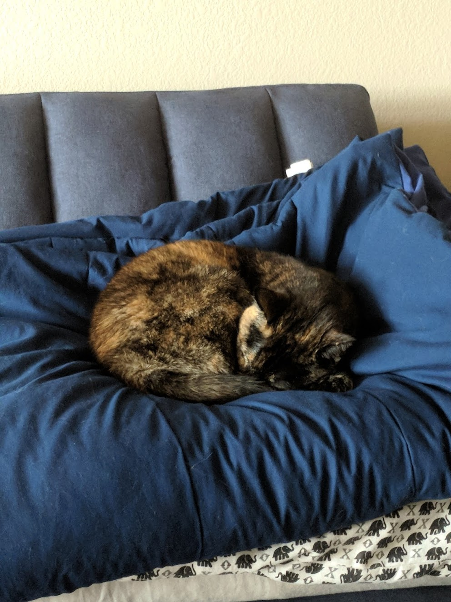

<!-- START doctoc generated TOC please keep comment here to allow auto update -->
<!-- DON'T EDIT THIS SECTION, INSTEAD RE-RUN doctoc TO UPDATE -->
**Table of Contents**  *generated with [DocToc](https://github.com/thlorenz/doctoc)*

- [Kubernetes TensorFlow Model Server](#kubernetes-tensorflow-model-server)
  - [Create Google Cloud Platform (GCP) Project](#create-google-cloud-platform-gcp-project)
  - [Build a Model Server Docker Image](#build-a-model-server-docker-image)
    - [Set the User (Optional)](#set-the-user-optional)
    - [Build the Image](#build-the-image)
  - [Create a Bucket](#create-a-bucket)
  - [Upload a Model](#upload-a-model)
  - [Create a Kubernetes Cluster](#create-a-kubernetes-cluster)
  - [Configure kubectl](#configure-kubectl)
    - [Deploy your model to Kubernetes](#deploy-your-model-to-kubernetes)
      - [Use service account credential to serve a model on GCS](#use-service-account-credential-to-serve-a-model-on-gcs)
    - [Use the served model](#use-the-served-model)
      - [Setup](#setup)
      - [Running the script directly](#running-the-script-directly)
      - [Run the REST API script](#run-the-rest-api-script)
      - [Run in Docker container with publicly exposed service](#run-in-docker-container-with-publicly-exposed-service)
      - [Run container on your kubernetes cluster](#run-container-on-your-kubernetes-cluster)
      - [Output](#output)

<!-- END doctoc generated TOC please keep comment here to allow auto update -->

# Kubernetes TensorFlow Model Server
This repository contains docker files and manifests to deploy a generic
[TensorFlow model server](https://www.tensorflow.org/serving/) on a [Kubernetes](https://kubernetes.io/) cluster.
Rather them baking the served model into the image, as the TensorFlow inception example demonstrates, this
example demonstrates how to serve a model from distributed storage.  [GKE](https://cloud.google.com/kubernetes-engine/)
(Google Kubernetes Engine) and [GCS](https://cloud.google.com/storage/) (Google Cloud Storage) are used here,
but the example is trivially adaptable to an on-premises (on-prem) cluster using NFS (Network File System) or
HDFS (Hadoop Distributed File System), or an AWS (Amazon Web Services)cluster using S3 (Simple Storage Service).

## Create Google Cloud Platform (GCP) Project
This tutorial uses [GCP](https://cloud.google.com/).
[This documentation](https://cloud.google.com/resource-manager/docs/creating-managing-projects) demonstrates how to
create and manage a new Project on GCP. There is a [free tier](https://cloud.google.com/free/) available that you can
use to try it out.

## Build a Model Server Docker Image
The [docker file](docker/Dockerfile) builds a docker image containing default the TensorFlow model server tuned for
amd64 architecture. You can modify this file to support the architecture of your choice.

### Set the User (Optional)
Note the line at the beginning of the Dockerfile.

```
ENV MS_USER=model-server
```

This is the user that the model-server process will run as. You can modify this user to change the name. This user
will be used in the Kubernetes Deployment's PodSecurityContext so that the container is not run with root privileges
(This is considered to be a best practice).

### Build the Image
A [Makefile](docker/Makefile) is included that will build the image and push it to private hosting inside your project.

Download and install the [Google Cloud SDK](https://cloud.google.com/sdk/downloads) (Software Development Kit).

Make sure that the `gcloud` command line tool is [configured to use the desired
project](https://cloud.google.com/sdk/docs/managing-properties).

Enable the [GCR](https://cloud.google.com/container-registry/docs/quickstart) (Google Container Registry) API in
your project. You can do this directly from the command line:

```commandline
gcloud services enable containerregistry.googleapis.com
```

The command below will build the docker image.

```commandline
make PROJECT_ID=$(gcloud config get-value project) all
```

The command below will push the docker image to your project's GCR.

```commandline
make PROJECT_ID=$(gcloud config get-value project) push
```

We will be using this image to serve your model later in this guide.

You can learn more about [building a TensorFlow model server](https://www.tensorflow.org/serving/serving_advanced) and
running a [TensorFlow model server in docker](https://www.tensorflow.org/serving/docker) in the TensorFlow Serving
documentation.

## Create a Bucket
You are going to serve the model from [GCS](https://cloud.google.com/storage/).

Download and install the [Google Cloud SDK](https://cloud.google.com/sdk/downloads) (Software Development Kit).

Use the [gsutil mb](https://cloud.google.com/storage/docs/gsutil/commands/mb) command to create a bucket. Note that
the bucket name must be globally unique.
```commandline
gsutil mb gs://<bucket-name>
```


## Upload a Model
You can train an inception model using the instructions from the
[TensorFlow documentation](https://www.tensorflow.org/tutorials/image_retraining), or you can use the pre-uploaded, pre-trained [gcs bucket](gs://kubeflow-models/inception) directly.

If using your own trained inception model, use [gsutil cp](https://cloud.google.com/storage/docs/gsutil/commands/cp) to upload the inception model to the cloud
storage bucket you created above.
```commandline
gsutil cp -r inception gs://<bucket-name>
```

Use [gsutil ls](https://cloud.google.com/storage/docs/gsutil/commands/ls) to view the contents of your bucket. You
will see that the contents of the model are stored in the `gs://<bucket-name>/inception/1` directory. This is the
first version of the model that we will serve.

```commandline
gsutil ls -r gs://<bucket-name>/
gs://<bucket-name>/inception/:
gs://<bucket-name>/inception/

gs://<bucket-name>/inception/1/:
gs://<bucket-name>/inception/1/
gs://<bucket-name>/inception/1/saved_model.pb

gs://<bucket-name>/inception/1/variables/:
gs://<bucket-name>/inception/1/variables/variables.data-00000-of-00001
gs://<bucket-name>/inception/1/variables/variables.index
```

## Create a Kubernetes Cluster

Use [gcloud container clusters create](https://cloud.google.com/sdk/gcloud/reference/container/clusters/create) to turn
up a new Kubernetes cluster.
```commandline
gcloud container clusters create model-serving --machine-type=n1-standard-4
```
This will create a 3 Node cluster using the n1-standard-4 machine shape for each Node.

After creation is complete, you can use
[gcloud container clusters describe](https://cloud.google.com/sdk/gcloud/reference/container/clusters/describe) to view
your cluster.

## Configure kubectl
In order to create Kubernetes workloads, you need to configure [kubectl](https://kubernetes.io/docs/user-guide/kubectl/)
to communicate with your cluster. Use
[gcloud container clusters get-credentials](https://cloud.google.com/sdk/gcloud/reference/container/clusters/describe)
to configure kubectl.

```commandline
gcloud container clusters get-credentials model-serving --zone <your-zone> --project <your-project>
```


### Deploy your model to Kubernetes

Now we will combine the image and model collected/created in the previous steps by using ksonnet to configure and deploy them to Kubernetes.

We treat each deployed model as a [component](https://ksonnet.io/docs/tutorial#2-generate-and-deploy-an-app-component) in your ksonnet app.

Create a component for your model inside your ksonnet app (refer to the [guide](https://www.kubeflow.org/docs/guides/components/ksonnet/) for more context on ksonnet)

```commandline
ks init my-model-server
cd my-model-server
ks registry add kubeflow github.com/kubeflow/kubeflow/tree/master/kubeflow
ks pkg install kubeflow/tf-serving
ks env add  cloud
ks env set cloud --namespace ${NAMESPACE}

MODEL_COMPONENT=serveInception
MODEL_NAME=inception
#Replace this with the url to your bucket if using your own model
MODEL_PATH=gs://kubeflow-models/inception
MODEL_SERVER_IMAGE=gcr.io/$(gcloud config get-value project)/model-server:1.0
ks generate tf-serving ${MODEL_COMPONENT} --name=${MODEL_NAME}
ks param set --env=cloud ${MODEL_COMPONENT} modelPath $MODEL_PATH
# If you want to use your custom image.
ks param set --env=cloud ${MODEL_COMPONENT} modelServerImage $MODEL_SERVER_IMAGE
# If you want to have the http endpoint.
ks param set --env=cloud ${MODEL_COMPONENT} deployHttpProxy true
# If you want to use GPU
ks param set --env=cloud ${MODEL_COMPONENT} numGpus 1
```

Deploy it in a particular environment. The deployment will pick up environment parmameters (e.g. cloud) and customize the deployment appropriately

```
ks apply cloud -c ${MODEL_COMPONENT}
```

You can use [kubectl get](https://kubernetes.io/docs/reference/generated/kubectl/kubectl-commands#get) to view the
status of the Deployment.

```commandline
kubectl get deployment inception
NAME        DESIRED   CURRENT   UP-TO-DATE   AVAILABLE   AGE
$MODEL_NAME 1         1         1            1           1m
```

You can learn more about [updating a Deployment](https://kubernetes.io/docs/concepts/workloads/controllers/deployment/#updating-a-deployment),
[scaling a Deployment](https://kubernetes.io/docs/concepts/workloads/controllers/deployment/#scaling-a-deployment), and
[Pod Resources](https://kubernetes.io/docs/concepts/configuration/manage-compute-resources-container/) in the
Kubernetes documentation.

#### Use service account credential to serve a model on GCS
TF serving can read the model directly from GCS. But by default it will use the credential of the cluster.
If you want to use the credential of a service account to read the model from a GCS bucket:
* Download the service account key
* Create a k8s secret:
```commandline
kubectl create secret generic SECRET_NAME --namespace={NAMESPACE} --from-file=key.json=YOUR_KEY_FILE
```
And before applying the TF serving component, set additional two params:
```commandline
ks param set --env=cloud ${MODEL_COMPONENT} cloud gcp
ks param set --env=cloud ${MODEL_COMPONENT} gcpCredentialSecretName SECRET_NAME
```

### Use the served model

The [inception-client](./inception-client) directory contains a Python script you can use to make a call against the deployed model.

This script is intended to be run externally to the kubernetes cluster as a demonstration that the inception model is correctly being served.
You can run the script either directly from a Python2 environment or in a Docker container.

#### Setup

You will require the external IP for the inception service as well as the port it is being hosted on. The inception service should be
listed under the value you used for the `MODEL_NAME` parameter in the ksonnet component. You can find this information using
```commandline
kubectl get services
NAME         TYPE           CLUSTER-IP      EXTERNAL-IP      PORT(S)			 AGE
$MODEL_NAME  LoadBalancer   <INTERNAL IP>   <SERVICE IP>     <SERVICE PORT>:<NODE PORT>,<HTTP SERVICE PORT>:<NODE PORT>  <TIME SINCE DEPLOYMENT>
```

We will feed the `<SERVICE IP>` and `<SERVICE PORT>` to the labelling script. We will use it to label the following image of a
cat sleeping on a comforter atop a sofa:



You can also use it to label your own images.

#### Running the script directly

You can run the script directly in your local environment if Python2 is available to you. You will not be able to use the script with Python3
as the [`tensorflow-serving-api` package](https://pypi.python.org/pypi/tensorflow-serving-api)
is not yet Python3-capable ([Issue #117](https://github.com/kubeflow/kubeflow/issues/117)).

If you would like to use a virtual environment, begin by activating your desired environment with your favorite environment manager. Then,
```commandline
pip install -r requirements.txt
```

Run the script as follows:

```commandline
python label.py -s <SERVICE IP> -p <SERVICE PORT> images/sleeping-pepper.jpg
```

#### Run the REST API script

You can query the model with `curl` directly.

```commandline
(echo '{"instances": [{"image_contents": {"b64": "'; base64 ./inception-client/images/sleeping-pepper.jpg; echo '"}}]}') | curl -H "Content-Type: application/json" -X POST -d @-  <SERVICE IP>:<HTTP SERVICE PORT>/model/image_classification:predict
```

If you followed the
[instruction](https://github.com/kubeflow/kubeflow/blob/master/docs/gke/iap.md#setup-ingress) to setup the ingress (IAP part is optional),
the model can be accessed from the following:
```commandline
curl -H "Content-Type: application/json" -X POST -d @input_file DOMAIN/models/MODEL_NAME:predict
```


OUTPUTS

```
{"predictions":
	[
		{
		  "labels": "Border terrier",
		  "probs": 0.12965676188468933
		},
		{
		  "labels": "bull mastiff",
		  "probs": 0.10835129022598267
		},
		{
		  "labels": "malinois",
		  "probs": 0.10788080841302872
		},
		{
		  "labels": "boxer",
		  "probs": 0.03579695522785187
		},
		{
		  "labels": "French bulldog",
		  "probs": 0.02937905490398407
		}
	  ]
}
```

#### Run in Docker container with publicly exposed service

The [inception-client](./inception-client) directory also contains a [Dockerfile](./inception-client/Dockerfile) that will allow you to
call out to the inception service from a container. You can run this container on your local machine if you publicly exposed your
`inception` service. If you would like to do this on GKE, simply run

```commandline
kubectl edit service inception
```

and change the service type to `NodePort` or `LoadBalancer`.

From that directory, start by building the image:

```commandline
docker build -t inception-client .
```

You can optionally specify a directory containing the JPEG files you would like to label using the
```commandline
--build-arg IMAGES_DIR=<path-to-image-directory>
```

By default, this build uses [inception-client/images](./inception-client/images).

Then run the container with the appropriate cluster information:

```commandline
docker run -v $(pwd):/data inception-client <SERVICE IP> <SERVICE PORT>
```

#### Run container on your kubernetes cluster

If your inception service is not publicly exposed, you can also run the client container directly on the kubernetes cluster on which the
inception model is being served. To do this:

1. Build the docker image as specified above. From the [inception-client](./inception-client) directory:
```commandline
docker build -t inception-client .
```

1. Prefix the tag with your GCR registry:
```commandline
GCR_TAG=gcr.io/$(gcloud config get-value project)/inception-client:latest
docker image tag inception-client:latest $GCR_TAG
```

1. Push the image to your project's container registry:
```commandline
gcloud docker -- push $GCR_TAG
```

1. Run a container built from that image on your GKE cluster:
```commandline
kubectl run -it inception-client --image $GCR_TAG --restart=OnFailure
```

#### Output

No matter how you run the script, you should see the following output:

```
outputs {
  key: "classes"
  value {
    dtype: DT_STRING
    tensor_shape {
      dim {
        size: 1
      }
      dim {
        size: 5
      }
    }
    string_val: "sleeping bag"
    string_val: "Border terrier"
    string_val: "tabby, tabby cat"
    string_val: "quilt, comforter, comfort, puff"
    string_val: "studio couch, day bed"
  }
}
outputs {
  key: "scores"
  value {
    dtype: DT_FLOAT
    tensor_shape {
      dim {
        size: 1
      }
      dim {
        size: 5
      }
    }
    float_val: 8.5159368515
    float_val: 7.85043668747
    float_val: 5.88767671585
    float_val: 5.706138134
    float_val: 5.55422878265
  }
}
```
