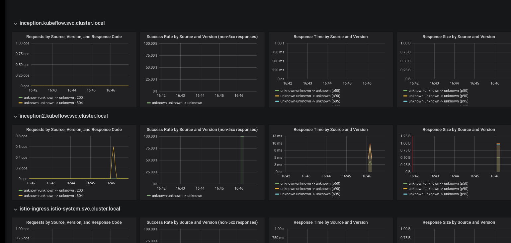

# Istio integration for TF serving

[Istio](https://istio.io/) provides a lot of functionality that we want to have, such as metrics, auth and
quota, rollout and A/B testing. We have an [issue](https://github.com/kubeflow/kubeflow/issues/464) to track
the progress.

## Install Istio
Follow the istio [doc](https://istio.io/docs/setup/kubernetes/quick-start.html#installation-steps)
to install istio.
After the installation, you should see services istio-pilot and istio-mixer in namespace istio-system.

### Install and configure istio sidecar injector
We are using automatic sidecar injection.
This requires Kubernetes 1.9 or above.

Follow the [doc](https://istio.io/docs/setup/kubernetes/sidecar-injection.html#automatic-sidecar-injection)
to install the secret and configmap.
Install the CA secret:
```
./install/kubernetes/webhook-create-signed-cert.sh \
    --service istio-sidecar-injector \
    --namespace istio-system \
    --secret sidecar-injector-certs
```

Before apply the configmap, we are going to make some change.

By default, the sidecar injector is "enabled" and all pods in certain namespace will be injected.
We want the opposite that the sidecar is only injected when we explicitly add some annotation.
 - Change `install/kubernetes/istio-sidecar-injector-configmap-release.yaml` so that the policy 
   (the first line of config) is "disabled".

Istio by default denies all egress traffic. This is to allow egress traffic for GCP. If you are on other cloud, check [here](https://istio.io/docs/tasks/traffic-management/egress.html#calling-external-services-directly).
 - For arguments of the initContainer istio-init: after "-u 1337", add "-i 10.4.0.0/14,10.7.240.0/20".
   

Apply the configmap:
```
kubectl apply -f install/kubernetes/istio-sidecar-injector-configmap-release.yaml
```

Install the injector:
```
cat install/kubernetes/istio-sidecar-injector.yaml | \
     ./install/kubernetes/webhook-patch-ca-bundle.sh > \
     install/kubernetes/istio-sidecar-injector-with-ca-bundle.yaml

kubectl apply -f install/kubernetes/istio-sidecar-injector-with-ca-bundle.yaml
```

The injector will inject the istio sidecar to all the pods if both conditions are true
1. the namespace has label: "istio-injection=enabled"
2. the deployment has annotation "sidecar.istio.io/inject: true"

Therefore, label the namespace of kubeflow deployment:
```
kubectl label namespace ${NAMESPACE} istio-injection=enabled
```

## Kubeflow TF Serving with Istio

Istio by default [denies egress traffic](https://istio.io/docs/tasks/traffic-management/egress.html).
Since TF serving component might need to read model files from outside (GCS, S3 etc), we need some
cloud-specific [setting](https://istio.io/docs/tasks/traffic-management/egress.html#calling-external-services-directly). 
Currently it's for GCP only.

After installing Istio, we can deploy the TF Serving component as in [README](README.md) with
additional params:
```
ks param set --env=cloud ${MODEL_COMPONENT} deployIstio true
```

This will inject an istio sidecar in the TF serving deployment.

### Metrics
The istio sidecar reports data to [Mixer](https://istio.io/docs/concepts/policy-and-control/mixer.html).
We can view the istio dashboard by [installing Grafana](https://istio.io/docs/tasks/telemetry/using-istio-dashboard.html#viewing-the-istio-dashboard).
Execute the command:
```
kubectl -n istio-system port-forward $(kubectl -n istio-system get pod -l app=grafana -o jsonpath='{.items[0].metadata.name}') 3000:3000 &
```
Visit http://localhost:3000/dashboard/db/istio-dashboard in your web browser.
Send some requests to the TF serving service, then there should be some data (QPS, success rate, latency) like



#### Define and view metrics
See istio [doc](https://istio.io/docs/tasks/telemetry/metrics-logs.html).

#### Expose Grafana dashboard behind ingress/IAP
To expose the grafana dashboard as, e.g. `YOUR_HOST/grafana`, follow these steps.

  1. Add ambassador annotation for routing. However, since ambassador only scans the service within
  its [namespace](https://www.getambassador.io/reference/advanced),
  we can add the annotation for grafana service in ambassador service. So do 
  `kubectl edit svc -n kubeflow ambassador`, and add annotation
 
  ```
  getambassador.io/config: |
    ---
    apiVersion: ambassador/v0
    kind:  Mapping
    name:  grafana_dashboard_mapping
    prefix: /grafana/
    service: grafana.istio-system:3000
  ```
 
  2. Grafana needs to be [configured](http://docs.grafana.org/installation/behind_proxy/#examples-with-sub-path-ex-http-foo-bar-com-grafana)
  to work properly behind a reverse proxy. We can override the default config using
  [environment variable](http://docs.grafana.org/installation/configuration/#using-environment-variables).
  So do `kubectl edit deploy -n istio-system grafana`, and add env vars
  ```
  - name: GF_SERVER_DOMAIN
    value: YOUR_HOST
  - name: GF_SERVER_ROOT_URL
    value: '%(protocol)s://%(domain)s:/grafana'
  ```
