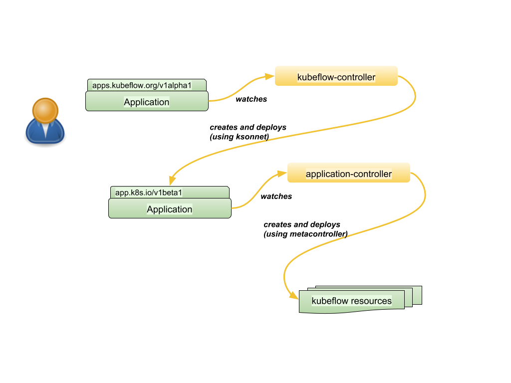

# Kubeflow Controller

## Goals

- Have a common client API (gcp-click-to-deploy and kfctl.sh)
- Define and manipulate ksonnet apps without requiring ksonnet installation on the client
- CRUD operations on an Application CRD which results in modifications to the underlying ksonnet app
- Use ksonnet modules which can nest ksonnet components
- Migrate kfctl.sh to kfctl (golang)

## Use Cases

- Openvino use case - need to add the openvino component within it’s pipeline. Since the dls.pipeline is static, the ContainerOp will need to add a new component to the current kubeflow application. Is it possible to have a dynamic dag in the pipeline dsl?
- Seldon use case where seldon was deployed as a new component after the initial deployment
- Coach RL use case (TBD)

## Current Design

A Kubeflow Application is created by the bootstrapper. 
The bootstrapper is a golang server that is deployed by running 

```bash
kubectl create -f bootstrapper.yaml
```

The contents of bootstrapper.yaml will deploy a pod that runs the golang server.
The server will listen for HTTP PUT’s that define a kubeflow application. The server can also read from a configmap that is mounted locally. In both cases a json definition is used that the golang server accepts and builds a ksonnet application. This json definition is mapped to the AppConfig golang struct:

```go
type RegistryConfig struct {
  Name    string `json:"name,omitempty"`
  Repo    string `json:"repo,omitempty"`
  Version string `json:"version,omitempty"`
  Path    string `json:"path,omitempty"`
  RegUri  string `json:"reguri,omitempty"`
}

type KsParameter struct {
  Component string `json:"component,omitempty"`
  Name      string `json:"name,omitempty"`
  Value     string `json:"value,omitempty"`
}

type KsComponent struct {
  Name      string `json:"name"`
  Prototype string `json:"prototype"`
}

type KsPackage struct {
  Name string
  // Registry should be the name of the registry containing the package.
  Registry string
}

type AppConfig struct {
  Registries []RegistryConfig `json:"registries,omitempty"`
  Packages   []KsPackage      `json:"packages,omitempty"`
  Components []KsComponent    `json:"components,omitempty"`
  Parameters []KsParameter    `json:"parameters,omitempty"`
}
```

An example of a configmap that has an instance of AppConfig is shown below within the defaultApp definition

```yaml
apiVersion: v1
data:
# Assume user access app via "kubectl port-forward ${pod-name} 3000:3000 8080:8080,
# otherwise change address below to your address pointing to controller-backend
  app-config.yaml: |
    appAddress: https://deploy.kubeflow.dev
    defaultApp:
      components:
      - name: jupyter
        prototype: jupyter
      - name: pipeline
        prototype: pipeline
      - name: argo
        prototype: argo
      - name: ambassador
        prototype: ambassador
      - name: centraldashboard
        prototype: centraldashboard
      - name: tf-job-operator
        prototype: tf-job-operator
      - name: cloud-endpoints
        prototype: cloud-endpoints
      - name: cert-manager
        prototype: cert-manager
      - name: iap-ingress
        prototype: iap-ingress
      parameters:
      - component: cloud-endpoints
        name: secretName
        value: admin-gcp-sa
      - component: cert-manager
        name: acmeEmail
        # TODO: use your email for ssl cert
        value: johnDoe@acme.com
      - component: iap-ingress
        name: ipName
        # TODO: make sure value of ipName is the same as property <ipName>.
        value: ipName
      - component: iap-ingress
        name: hostname
        # TODO: replace with Name of GCP project. This is fully qualified domain name to use with ingress.
        value: kubeflow.endpoints.<Project>.cloud.goog
      - component: jupyter
        name: jupyterHubAuthenticator
        value: iap
      - component: jupyter
        name: cloud
        value: gke
      - component: ambassador
        name: cloud
        value: gke
      registries:
      - name: kubeflow
        repo: https://github.com/kubeflow/kubeflow
        # default leave empty
        version:
        path: kubeflow
kind: ConfigMap
metadata:
  name: kubeflow-controller
  namespace: default
```

As noted, the embedded yaml above is used by the golang server to generate a ksonnet application and deploy it. A ksonnet application definition is shown below:

```yaml
apiVersion: 0.3.0
environments:
  default:
    destination:
      namespace: kubeflow
      server: https://35.185.234.170
    k8sVersion: v1.10.7
    path: default
kind: ksonnet.io/app
libraries:
  kubeflow/application:
    name: application
    registry: kubeflow
    version: ""
  kubeflow/argo:
    name: argo
    registry: kubeflow
    version: ""
  kubeflow/core:
    name: core
    registry: kubeflow
    version: ""
  kubeflow/examples:
    name: examples
    registry: kubeflow
    version: ""
  kubeflow/jupyter:
    name: jupyter
    registry: kubeflow
    version: ""
  kubeflow/katib:
    name: katib
    registry: kubeflow
    version: ""
  kubeflow/metacontroller:
    name: metacontroller
    registry: kubeflow
    version: ""
  kubeflow/mpi-job:
    name: mpi-job
    registry: kubeflow
    version: ""
  kubeflow/profiles:
    name: profiles
    registry: kubeflow
    version: ""
  kubeflow/pytorch-job:
    name: pytorch-job
    registry: kubeflow
    version: ""
  kubeflow/seldon:
    name: seldon
    registry: kubeflow
    version: ""
  kubeflow/tf-serving:
    name: tf-serving
    registry: kubeflow
    version: ""
  kubeflow/tf-training:
    name: tf-training
    registry: kubeflow
    version: ""
name: ks_app
registries:
  incubator:
    protocol: github
    uri: github.com/ksonnet/parts/tree/master/incubator
  kubeflow:
    protocol: fs
    uri: /Users/kdkasrav/go/src/github.com/kubeflow/kubeflow/kubeflow
version: 0.0.1
```

Currently as part of all kubeflow deployments an Application CR is generated and deployed along with the other manifests. An example Application CR is shown below:

```yaml
apiVersion: app.k8s.io/v1beta1
kind: Application
metadata:
  annotations:
    ksonnet.io/managed: '{"pristine":"H4sIAAAAAAAA/7xZQa+jNhC+92f4HNJd9VK92zZ7bKVqn7SXVQ+DmSR+GNuyh6TZp/z3ygQC5plAAumNwDefP38zNuPwzsCI72id0Iq9MDBmnf/u1kL/evicIsFntmK5UBl7YV+MkYIDeeSKFUiQAQF7eWcSUpTOX4ExF5YOsuIsU7QKCStqBQV+gOVOK4Xkn3NdGK1QUQ90XrFoqL/pDHD/xI+0lfrowc4g96qufI69/HhnUKTgHGTa+of17F7RHgRHdj6vuogEskKocZxH7Kwu/fRtCnwNJe21FT8rjbWnrZcbWTpC+03LKFM41hfOdalouSH/ECoTaneLEP8lVL4oXMvwFY3UpwIbKUdtc2+1W4PdaWP1mx+wQwJGtDwfBZWOdPENnS4tx6+4FUpc0twlT7hWZLWUeLc+ryopxYywWM4jwvzlVuwKMJ2gTXXvLzAt61hqa8isOprFERbGkA8fRPdMflT3LJpAOkdFFmQGbp9qsNm9JRCLj9XCOC7w6pasCbNt3XorzYmudTdcdA3u09AEakC4aE3HmVcCwm0pX5FCSuvFzNWvNGGqdb4Mm0wnTPNGevqqJsIf1B4U7FKGBKQH8VNURWJxyJge5J41Uodmg6bHAH/7TsMRKvquZVngRoIoIvAHhPTn8MgutAjV9BwE5dRBJhYdTUjZFXePXTmQSG+837rPH0iDK3c7dN6jxILKdDEyjyh+3rg7KwZ37GH0vDH3J4M2BXXHwEHIvNFTOKEToLQhUdQlOl3IUPQ9mhyV2elNp27dNOBrbXdLNYMFkhXcJdy3W5zmt9tRwhuLc0EBwfZQ815pE8LCSCAcfqc3Tg80xo+4MUB5w49FRQSOjDBPPZfgFCurc6EThO1Ybu0Ptu3vRvdChdwSWzyIC8NTB8yQawuk7f82RU/ePRu5evMZXWBBFL+UR9UHJWldIIutOYgX10jr2zRnz9njruxDG3cM0CvoABKfVX+xXDvOuCXxUmmn1KygTRtd0Rqrt0Lic6wyaAvh6shn8Nfih1+heHz4tBIh72Wxi5iWxCZi6SS2Pi/NfPJb0j7RBqvdafQk2w8Y2U5i8DlvyOX4gq2opn1a33RL9qSuzoAlyEs3u8OYTxR2CV2+W31Kg0sOWpaK8P5ugrZPSw9tE9/pXBdB85f73QpDmrG11MOPWBhBz6mExeiCeqhZR/+wG8fF5v7w/4i34meYtwBf694/K5ahQZWh4sK/dH5Udxy3wlxOgoyt2B5B0n6zR55fbgi11RdsjqejtlkdKYXK68sChCIQCm19Qx/ba4ftQaoA4vs/ux+Rxj8Ync8rRicTfPJZscP1S9an9W/sfP7lPwAAAP//AQAA//+PKjeg4BoAAA=="}'
  clusterName: ""
  creationTimestamp: 2018-11-21T16:33:55Z
  generation: 1
  labels:
    app: application
    app.kubernetes.io/deploy-manager: ksonnet
    app.kubernetes.io/name: application
    ksonnet.io/component: application
  name: application
  namespace: kubeflow
  resourceVersion: "5389740"
  selfLink: /apis/app.k8s.io/v1beta1/namespaces/kubeflow/applications/application
  uid: 3d17a712-edab-11e8-a4ad-42010a8a0153
spec:
  components:
  - ambassador:
      kind: Service
  - ambassador-admin:
      kind: Service
  - ambassador:
      group: rbac.authorization.k8s.io
      kind: ClusterRole
  - ambassador:
      kind: ServiceAccount
  - ambassador:
      group: rbac.authorization.k8s.io
      kind: ClusterRoleBinding
  - ambassador:
      group: extensions
      kind: Deployment
  - workflows.argoproj.io:
      group: apiextensions.k8s.io
      kind: CustomResourceDefinition
  - workflow-controller:
      group: extensions
      kind: Deployment
  - argo-ui:
      group: extensions
      kind: Deployment
  - argo-ui:
      kind: Service
  - workflow-controller-configmap:
      kind: ConfigMap
  - argo:
      kind: ServiceAccount
  - argo:
      group: rbac.authorization.k8s.io
      kind: ClusterRole
  - argo:
      group: rbac.authorization.k8s.io
      kind: ClusterRoleBinding
  - argo-ui:
      kind: ServiceAccount
  - argo-ui:
      group: rbac.authorization.k8s.io
      kind: ClusterRole
  - argo-ui:
      group: rbac.authorization.k8s.io
      kind: ClusterRoleBinding
  - centraldashboard:
      group: extensions
      kind: Deployment
  - centraldashboard:
      kind: Service
  - centraldashboard:
      kind: ServiceAccount
  - centraldashboard:
      group: rbac.authorization.k8s.io
      kind: Role
  - jupyter-config:
      kind: ConfigMap
  - jupyter-0:
      kind: Service
  - jupyter:
      group: apps
      kind: StatefulSet
  - jupyter-role:
      group: rbac.authorization.k8s.io
      kind: Role
  - jupyter-notebook-role:
      group: rbac.authorization.k8s.io
      kind: Role
  - jupyter-lb:
      kind: Service
  - jupyter:
      kind: ServiceAccount
  - jupyter-notebook:
      kind: ServiceAccount
  - jupyter-role:
      group: rbac.authorization.k8s.io
      kind: RoleBinding
  - jupyter-notebook-role:
      group: rbac.authorization.k8s.io
      kind: RoleBinding
  - vizier-core:
      kind: Service
  - vizier-core:
      group: extensions
      kind: Deployment
  - vizier-db:
      kind: Service
  - vizier-db:
      kind: PersistentVolumeClaim
  - vizier-db:
      group: extensions
      kind: Deployment
  - vizier-core:
      group: rbac.authorization.k8s.io
      kind: ClusterRole
  - vizier-core:
      group: rbac.authorization.k8s.io
      kind: ClusterRoleBinding
  - vizier-core:
      kind: ServiceAccount
  - vizier-core-rest:
      kind: Service
  - vizier-core-rest:
      group: extensions
      kind: Deployment
  - katib-ui:
      kind: Service
  - katib-ui:
      group: extensions
      kind: Deployment
  - vizier-suggestion-random:
      kind: Service
  - vizier-suggestion-random:
      group: extensions
      kind: Deployment
  - vizier-suggestion-grid:
      kind: Service
  - vizier-suggestion-grid:
      group: extensions
      kind: Deployment
  - vizier-suggestion-hyperband:
      kind: Service
  - vizier-suggestion-hyperband:
      group: extensions
      kind: Deployment
  - vizier-suggestion-bayesianoptimization:
      kind: Service
  - vizier-suggestion-bayesianoptimization:
      group: extensions
      kind: Deployment
  - studyjobs.kubeflow.org:
      group: apiextensions.k8s.io
      kind: CustomResourceDefinition
  - metrics-collector:
      group: rbac.authorization.k8s.io
      kind: ClusterRole
  - metrics-collector:
      kind: ServiceAccount
  - metrics-collector:
      group: rbac.authorization.k8s.io
      kind: ClusterRoleBinding
  - metricscollector-template:
      kind: ConfigMap
  - studyjob-controller:
      group: rbac.authorization.k8s.io
      kind: ClusterRole
  - studyjob-controller:
      kind: ServiceAccount
  - studyjob-controller:
      group: rbac.authorization.k8s.io
      kind: ClusterRoleBinding
  - studyjob-controller:
      group: extensions
      kind: Deployment
  - worker-template:
      kind: ConfigMap
  - compositecontrollers.metacontroller.k8s.io:
      group: apiextensions.k8s.io
      kind: CustomResourceDefinition
  - controllerrevisions.metacontroller.k8s.io:
      group: apiextensions.k8s.io
      kind: CustomResourceDefinition
  - decoratorcontrollers.metacontroller.k8s.io:
      group: apiextensions.k8s.io
      kind: CustomResourceDefinition
  - meta-controller-service:
      kind: ServiceAccount
  - meta-controller-cluster-role-binding:
      group: rbac.authorization.k8s.io
      kind: ClusterRoleBinding
  - metacontroller:
      group: apps
      kind: StatefulSet
  - notebooks.kubeflow.org:
      group: apiextensions.k8s.io
      kind: CustomResourceDefinition
  - notebooks:
      kind: Service
  - notebooks:
      kind: ConfigMap
  - notebooks:
      group: apps
      kind: Deployment
  - notebook-controller:
      group: metacontroller.k8s.io
      kind: CompositeController
  - profiles.kubeflow.org:
      group: apiextensions.k8s.io
      kind: CustomResourceDefinition
  - permissions.kubeflow.org:
      group: apiextensions.k8s.io
      kind: CustomResourceDefinition
  - profiles:
      kind: Service
  - view:
      group: rbac.authorization.k8s.io
      kind: Role
  - profiles:
      kind: ConfigMap
  - profiles:
      group: apps
      kind: Deployment
  - profiles-controller:
      group: metacontroller.k8s.io
      kind: CompositeController
  - permissions-controller:
      group: metacontroller.k8s.io
      kind: CompositeController
  - pytorch-operator-config:
      kind: ConfigMap
  - pytorch-operator:
      kind: ServiceAccount
  - pytorch-operator:
      group: rbac.authorization.k8s.io
      kind: ClusterRole
  - pytorch-operator:
      group: rbac.authorization.k8s.io
      kind: ClusterRoleBinding
  - pytorchjobs.kubeflow.org:
      group: apiextensions.k8s.io
      kind: CustomResourceDefinition
  - pytorch-operator:
      group: extensions
      kind: Deployment
  - spartakus:
      group: rbac.authorization.k8s.io
      kind: ClusterRole
  - spartakus:
      group: rbac.authorization.k8s.io
      kind: ClusterRoleBinding
  - spartakus:
      kind: ServiceAccount
  - spartakus-volunteer:
      group: extensions
      kind: Deployment
  - tfjobs.kubeflow.org:
      group: apiextensions.k8s.io
      kind: CustomResourceDefinition
  - tf-job-operator-v1beta1:
      group: extensions
      kind: Deployment
  - tf-job-operator-config:
      kind: ConfigMap
  - tf-job-operator:
      kind: ServiceAccount
  - tf-job-operator:
      group: rbac.authorization.k8s.io
      kind: ClusterRole
  - tf-job-operator:
      group: rbac.authorization.k8s.io
      kind: ClusterRoleBinding
  - tf-job-dashboard:
      kind: Service
  - tf-job-dashboard:
      kind: ServiceAccount
  - tf-job-dashboard:
      group: extensions
      kind: Deployment
  - tf-job-dashboard:
      group: rbac.authorization.k8s.io
      kind: ClusterRole
  - tf-job-dashboard:
      group: rbac.authorization.k8s.io
      kind: ClusterRoleBinding
  dependencies: []
  description: ""
  healthCheck: ""
  info: []
  keywords: []
  links: []
  maintainers: []
  owners: []
  selector:
    matchLabels:
      app.kubernetes.io/name: application
  type: kubeflow
  version: "0.3"
```

## Proposed Design

1. Define an Application kind (applications.apps.kubeflow.org) for kubeflow using existing types from bootstrapper
1. Migrate bootstrapper to a kubeflow-controller that receives this Application Kind
1. The kubeflow controller will generate a ksonnet application using the Application CR submitted by the client, as it currently does in bootstrap. The generated ksonnet application will just be an Application CR (applications.app.k8s.io) and a CompositeController (application-controller) that contains the components referenced in the ApplicationCR. The CompositeController will deploy all the components in-cluster (This work has already been done in a prior PR but was not merged).
1. The Application (applications.apps.kubeflow.org) CR will be owned by the kubeflow-controller. 
1. The Application (applications.app.k8s.io) and all components listed in the CR will be owned by the application-controller. 
1. Deleting the Application CR (applications.apps.kubeflowe.org) will result in a cascaded deleted and delete the Application CR (applications.app.k8s.io) and all resources which are owned by the application-controller. The flow is shown below.




