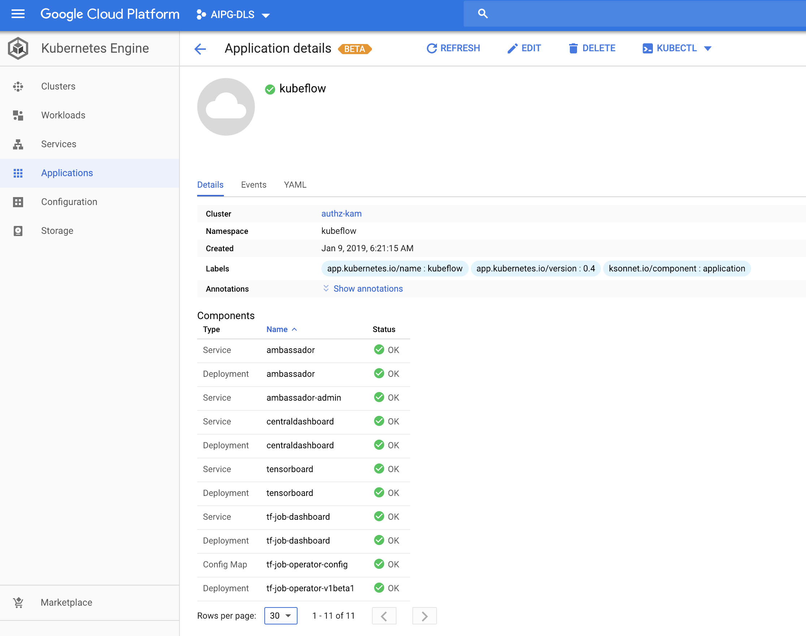

## Overview

The ksonnet application component creates an Application Custom Resource (CR) based on
ksonnet components generated under `<APP_DIR>/ks_app/components/`. The Application CR
will include the following components when you do not set a platform option.

```
"ambassador", "jupyter", "centraldashboard", "tf-job-operator", "pytorch-operator", "spartakus", "argo", "pipeline","katib"
```

The Application CR lists the resources in these components under componentKinds. After deploying kubeflow, if you run

```
kubectl get applications.app.k8s.io kubeflow -oyaml
```

you should get back something like:

```
apiVersion: app.k8s.io/v1beta1
kind: Application
metadata:
  annotations:
    kubectl.kubernetes.io/last-applied-configuration: |
      {"apiVersion":"app.k8s.io/v1beta1","kind":"Application","metadata":{"annotations":{},"labels":{"app.kubernetes.io/name":"kubeflow","app.kubernetes.io/version":"0.4","ksonnet.io/component":"application"},"name":"kubeflow","namespace":"kubeflow"},"spec":{"assemblyPhase":"Succeeded","componentKinds":[{"group":"v1","kind":"ConfigMap"},{"group":"apps/v1","kind":"Deployment"},{"group":"batch/v1","kind":"Job"},{"group":"v1","kind":"PersistentVolumeClaim"},{"group":"rbac.authorization.k8s.io/v1","kind":"RoleBinding"},{"group":"rbac.authorization.k8s.io/v1","kind":"Role"},{"group":"v1","kind":"Secret"},{"group":"v1","kind":"ServiceAccount"},{"group":"v1","kind":"Service"},{"group":"apps/v1beta1","kind":"StatefulSet"}],"descriptor":{"description":"","icons":[],"keywords":[],"links":[],"maintainers":[],"notes":"","owners":[],"type":"kubeflow","version":"0.4"},"info":[],"selector":{"matchLabels":{"app.kubernetes.io/name":"kubeflow"}}}}
  creationTimestamp: 2019-01-11T18:04:17Z
  generation: 1
  labels:
    app.kubernetes.io/name: kubeflow
    app.kubernetes.io/version: "0.4"
    ksonnet.io/component: application
  name: kubeflow
  namespace: kubeflow
  resourceVersion: "7534220"
  selfLink: /apis/app.k8s.io/v1beta1/namespaces/kubeflow/applications/kubeflow
  uid: 502e4301-15cb-11e9-a24e-42010a8a0044
spec:
  assemblyPhase: Succeeded
  componentKinds:
  - group: v1
    kind: ConfigMap
  - group: apps/v1
    kind: Deployment
  - group: batch/v1
    kind: Job
  - group: v1
    kind: PersistentVolumeClaim
  - group: rbac.authorization.k8s.io/v1
    kind: RoleBinding
  - group: rbac.authorization.k8s.io/v1
    kind: Role
  - group: v1
    kind: Secret
  - group: v1
    kind: ServiceAccount
  - group: v1
    kind: Service
  - group: apps/v1beta1
    kind: StatefulSet
  descriptor:
    description: ""
    icons: []
    keywords: []
    links: []
    maintainers: []
    notes: ""
    owners: []
    type: kubeflow
    version: "0.4"
  info: []
  selector:
    matchLabels:
      app.kubernetes.io/name: kubeflow
status:
  assemblyPhase: Succeeded
  created: true
  info: null
  observedGeneration: 1
  ready: "True"
```

Note: kfctl.sh can deploy a configurable set of the generated components by exporting the env variable DEFAULT_KUBEFLOW_COMPONENTS. This is shown under Example

## Options

- extendedInfo (=false)
Emits informational arrays in the status section of the Application CR.
This is enabled using the env var KUBEFLOW_EXTENDEDINFO=true.

## Example (Deploying a different set of components '["ambassador","centraldashboard","tf-job-operator","jupyter"]')

Create the script shown below as `kf`:

```bash
#!/usr/bin/env bash
KUBEFLOW_DIR=/Users/kdkasrav/go/src/github.com/kubeflow/kubeflow
NAME=${1:-kubeflow}

cd $HOME
if [[ -d $NAME ]]; then
  rm -rf $NAME
fi
$KUBEFLOW_DIR/scripts/kfctl.sh init $NAME --platform none && \
cd $HOME/$NAME && \
$KUBEFLOW_DIR/scripts/kfctl.sh generate all && \
$KUBEFLOW_DIR/scripts/kfctl.sh apply all
```

Then run

```bash
DEFAULT_KUBEFLOW_COMPONENTS='"ambassador","centraldashboard","tf-job-operator","jupyter"' ./kf
```

if you then run

```
kubectl get applications.app.k8s.io kubeflow -oyaml
```

you should get back something like:

```
```

## Kubeflow in the GKE monitoring dashboard  (Console -> Kubernetes Engine -> Applications)

After deploying kubeflow as shown in the example above, it can be viewed in the GCP Marketplace
(GKE console -> Kubernetes Engine -> Applications)

The application will look like below


