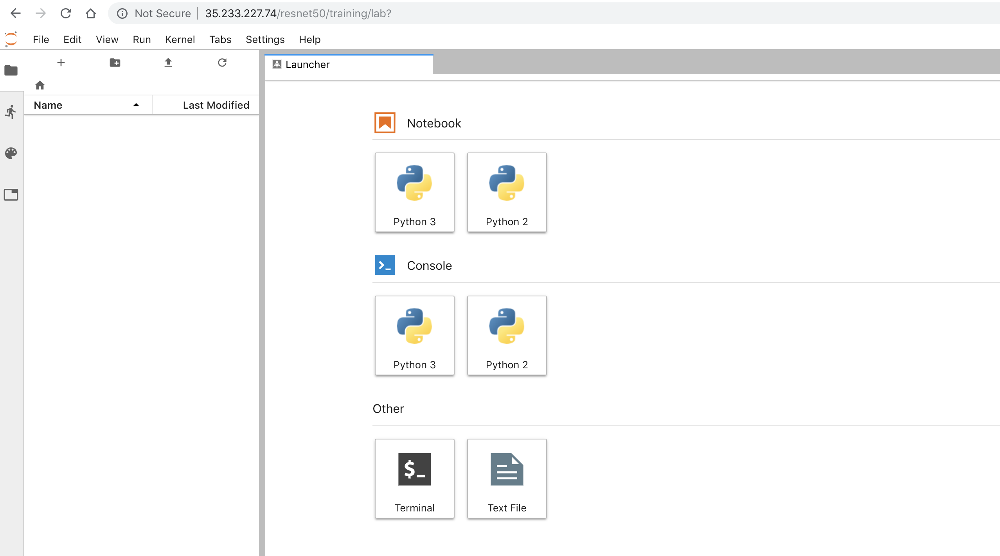

<!-- START doctoc generated TOC please keep comment here to allow auto update -->
<!-- DON'T EDIT THIS SECTION, INSTEAD RE-RUN doctoc TO UPDATE -->
**Table of Contents**  *generated with [DocToc](https://github.com/thlorenz/doctoc)*

- [Goals](#goals)
- [Design](#design)
  - [User Interaction](#user-interaction)

<!-- END doctoc generated TOC please keep comment here to allow auto update -->

## Goals

- provide a k8 native mechanism to spawning jupyter notebooks for users

- set a serviceAccountName within the spawning pod similar to jupyter-notebook

- allow similar params as kubeflow/common/prototypes/jupyterhub.jsonnet, including PVCs but use the kubernetes PodTemplateSpec


## Design

The Notebooks component is an alternative to jupyterhub. The component defines a Notebook CRD and provides a notebook-controller (based on metacontroller's [CompositeController](https://metacontroller.app/api/compositecontroller/)). The Notebook CRD schema is similar to a kubernetes [Deployment](https://kubernetes.io/docs/concepts/workloads/controllers/deployment/#creating-a-deployment) where it defines a [Pod Spec](https://kubernetes.io/docs/reference/generated/kubernetes-api/v1.12/#podspec-v1-core) within its [template section](https://github.com/kubeflow/kubeflow/blob/111975f3886d058a112c7970dce209714ddcfb2e/kubeflow/notebooks/notebooks.schema#L32) that is used by the notebook-controller to create a Deployment. Launching a notebook is nothing more than submitting a Notebook yaml to the api-server using kubectl. An example Notebook yaml is shown below:

```yaml
apiVersion: kubeflow.org/v1alpha1
kind: Notebook
metadata:
  name: training
  namespace: resnet50
spec:
  template:
    spec:
      containers:
      - name: notebook
        image: gcr.io/kubeflow-images-public/tensorflow-1.10.1-notebook-cpu:v0.3.0
        resources:
          requests:
            cpu: 500m
            memory: 1Gi
        workingDir: /home/jovyan
      securityContext:
        fsGroup: 100
        runAsUser: 1000
```

### User Interaction

The user submits a Notebook yaml either through a UI or CLI (eg `kubectl apply -f notebook.yaml`) and the Notebook yaml is handled by the notebook-controller. The notebook-controller will create a Service and Deployment within the namespaceset in the Notebook yaml. Note: the namespace must exist. The Service uses ambassador to create a reverse proxy that will route subsequent browser requests to the Pod. An example Service is shown below:

```yaml
apiVersion: v1
kind: Service
metadata:
  annotations:
    getambassador.io/config: |-
      ---
      apiVersion: ambassador/v0
      kind:  Mapping
      name: resnet50_training_mapping
      prefix: /resnet50/training
      rewrite: /resnet50/training
      timeout_ms: 300000
      service: training.resnet50
  labels:
    controller-uid: 038a2a66-e3e1-11e8-b1ac-42010a8a01b5
  name: training
  namespace: resnet50
  ownerReferences:
  - apiVersion: kubeflow.org/v1alpha1
    blockOwnerDeletion: true
    controller: true
    kind: Notebook
    name: training
    uid: 038a2a66-e3e1-11e8-b1ac-42010a8a01b5
spec:
  clusterIP: 10.103.254.68
  ports:
  - port: 80
    protocol: TCP
    targetPort: 8888
  selector:
    app: training
  type: ClusterIP
```

Subsequent browser requests to `https://<api-server>/<namespace>/<notebook>` are routed to the Service and Pod as shown below:



The notebook component can use the [profiles component](https://github.com/kubeflow/kubeflow/tree/master/kubeflow/profiles/prototypes) to provide a protected namespace for the user. It can also spawn the notebook within the kubeflow namespace.

```yaml
apiVersion: kubeflow.org/v1alpha1
kind: Profile
metadata:
  name: resnet50
  namespace: kubeflow
spec:
  template:
    metadata:
      namespace: resnet50
    spec:
      owner:
        kind: ServiceAccount
        name: dean
        namespace: kubeflow
```

If the user were a GKE IAM user, the Profile yaml would look like:

```yaml
apiVersion: kubeflow.org/v1alpha1
kind: Profile
metadata:
  name: resnet50
  namespace: kubeflow
spec:
  template:
    metadata:
      namespace: resnet50
    spec:
      owner:
        apiGroup: rbac.authorization.k8s.io
        kind: User
        name: fred@acme.com
status:
  conditions:
  - type: Ready
  created: true
  phase: Active
```

In this case the user is Fred and is identified within GKE's IAM by his email `fred@acme.com`.


