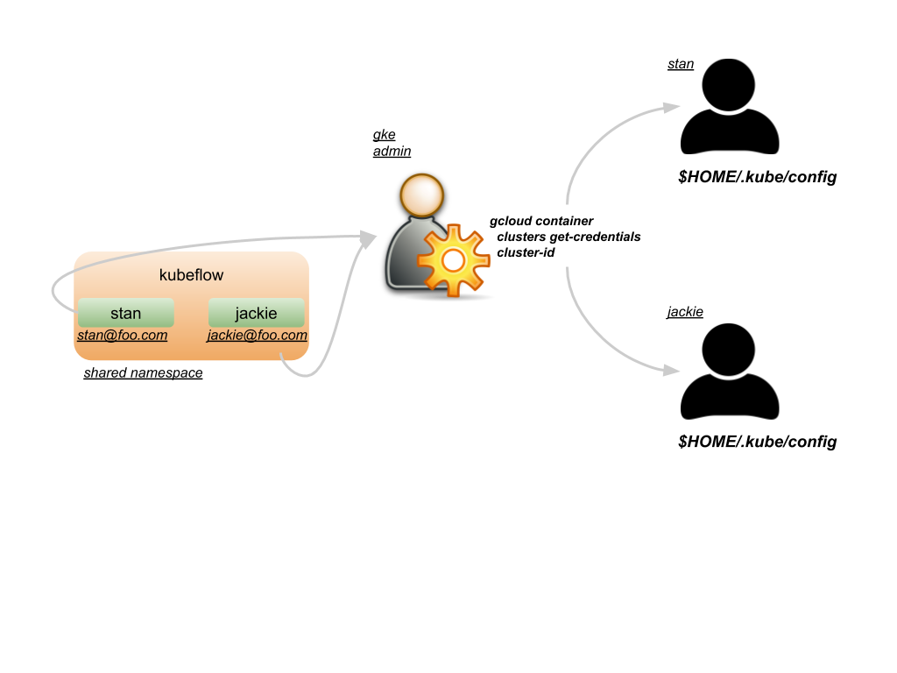

<!-- START doctoc generated TOC please keep comment here to allow auto update -->
<!-- DON'T EDIT THIS SECTION, INSTEAD RE-RUN doctoc TO UPDATE -->
**Table of Contents**  *generated with [DocToc](https://github.com/thlorenz/doctoc)*

- [Goals](#goals)
- [Design](#design)
  - [Data Structures](#data-structures)

<!-- END doctoc generated TOC please keep comment here to allow auto update -->

## Goals

- Provide a self-serve environment for data-scientists to create one or more protected namespaces where
notebooks, jobs, and other components can be deployed and run in this namespace.

- Use native kubernetes RBAC rules to isolate this namespace to a particular user's service account.

- Do not grant cluster wide privileges to a user when creating a protected namespace.

- Only use namespaced scoped Roles and RoleBindings.

- Separate infra components from user components where intra components reside in a shared/admin namespace and user components reside in protected namespaces.

- Allow a user to be either a ServiceAccount in the shared/admin namespace or a User which can map to a GKE IAM role.

- Enable a forward path to include proposed [Security Profiles](https://github.com/kubernetes/community/blob/a8cb2060dc621664c86b185c7426367994b181b5/keps/draft-20180418-security-profile.md)


## Design

Protected Namespaces allow a data scientist to use shared kubeflow components but within a namespace that is protected.


Users __stan__ and __jackie__ are able to run notebooks, jobs, and other components within their own protected namespace.


Users __stan__ and __jackie__ are subjects within the shared namespace. A subject can be either a User (for GKE a user can be their IAM role where their name is their email address) or a ServiceAccount. If they are ServiceAccounts, these may be created by the kubeflow admin within the kubeflow namespace and the secret tokens for each ServiceAccount distributed to each user and appended to their $HOME/.kube/config files.

- Service Account


- User



Per user, the kubeflow admin creates a RoleBinding for that user in the shared namespace. The RoleBinding's roleRef is a constained Role that only allows the user to create and get Profile CRs. The subject is - as noted above - a ServiceAccount or User.


For __stan__ the RoleBinding may look the following

```yaml
apiVersion: rbac.authorization.k8s.io/v1
kind: ClusterRoleBinding
metadata:
  name: stan
roleRef:
  apiGroup: rbac.authorization.k8s.io
  kind: ClusterRole
  name: profiles-view
subjects:
- kind: ServiceAccount
  name: stan
  namespace: kubeflow
```

The __view__ Role that __stan__ has (shown above) in the kubeflow shared namespace is:

```yaml
apiVersion: rbac.authorization.k8s.io/v1
kind: ClusterRole
metadata:
  name: profiles-view
rules:
- apiGroups:
  - kubeflow.org
  resources:
  - profiles
  verbs:
  - get
  - list
  - create
```

This means that users have very few privileges within the shared namespace, limited to creating and getting a Profile CR. In total - the CRDs are:

- Profile

Both custom resources have an associated controllers which do the following:

- profiles-controller
  - watches for __Profile__ Custom Resources
  - creates a Namespace, role and rolebinding

The user flow is as follows:


The controllers are namescoped and watch / create resources in different namespaces shown below:


### Data Structures

The Profile resource contains a template section where a namespace and owner are specified. The Profile resource is created within the shared namespace. An example is:

```yaml
apiVersion: kubeflow.org/v1alpha1
kind: Profile
metadata:
  name: stan
spec:
  owner:
    kind: User
    apiGroup: rbac.authorization.k8s.io
    name: stan@foo.com
```
