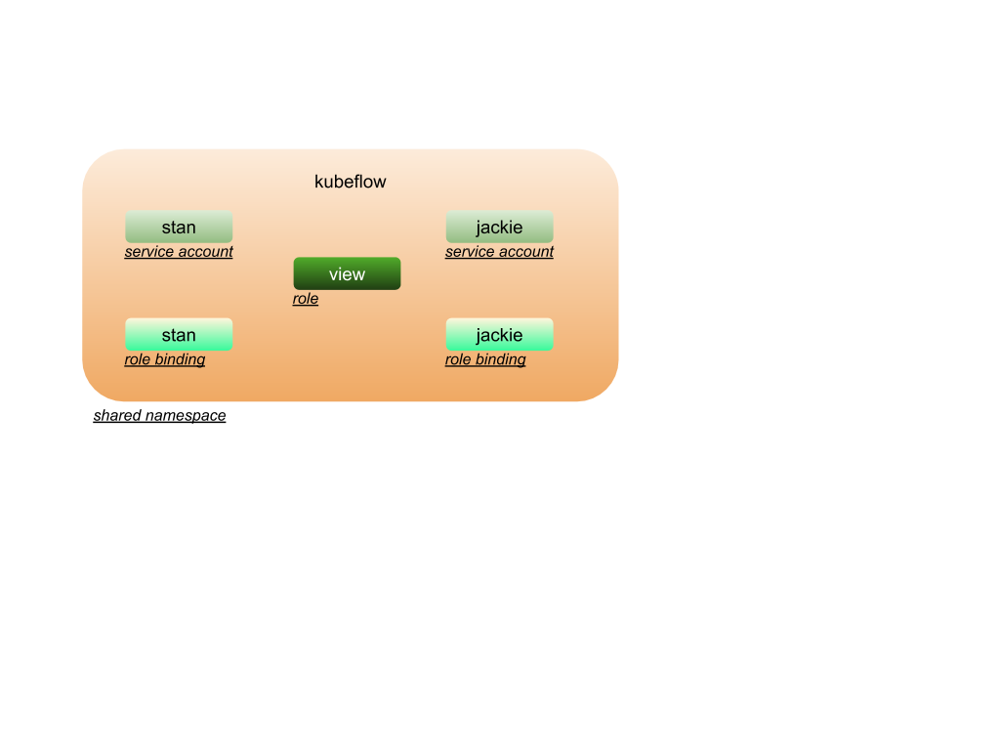
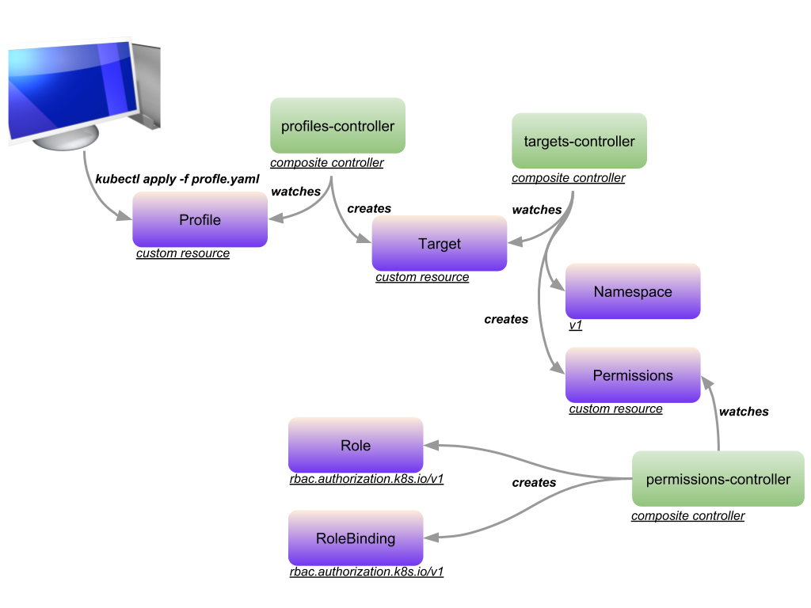
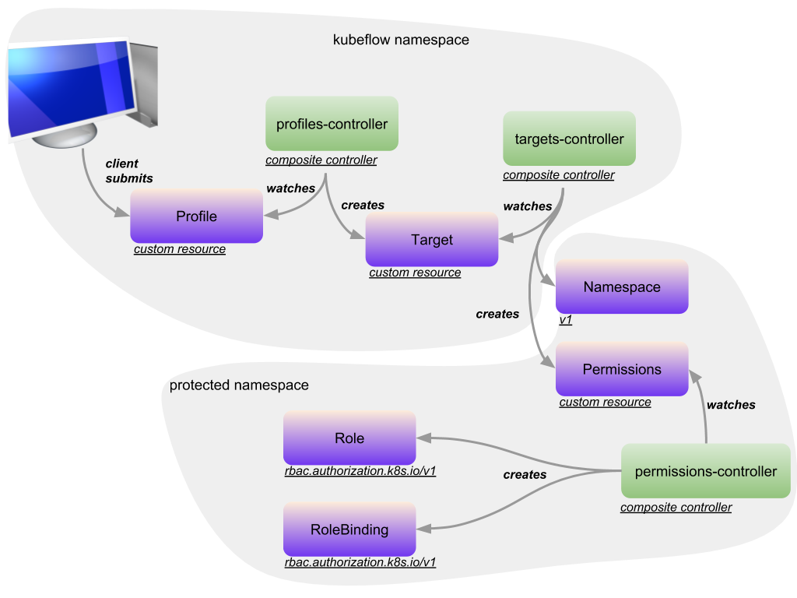

## Overview

### Goals

- Provide an easy way for data-scientists to create protected namespaces where 
notebooks, jobs, and other components can be deployed into this namespace.

- Use native kubernetes RBAC rules to isolate this namespace to a particular user's service account.

- Do not grant cluster wide privileges to a user when creating a protected namespace.

- Only use namespaced scoped Roles and RoleBindings.

- Separate infra components from user components where intra components reside in a shared/admin namespace and 
user components reside in protected namespaces.

- Enable a forward path to include proposed [Security Profiles](https://github.com/kubernetes/community/blob/a8cb2060dc621664c86b185c7426367994b181b5/keps/draft-20180418-security-profile.md) 	


## Design

Protected Namespaces allow a data scientist to use shared kubeflow components but within a namespace that is protected.


Users __stan__ and __jackie__ are able to run notebooks, jobs, and other components within their own protected namespace. 


Users __stan__ and __jackie__ are defined as service accounts within the shared namespace. This is something the kubeflow admin does by creating service accounts and distributing the service account secret tokens to the data scientists so they can be added to each user's $HOME/.kube/config. 


For each user, the kubeflow admin also creates a RoleBinding for that user in the shared namespace. The RoleBinding's roleRef is a constained Role that only allows the user to create and get Profile CRs.



For __stan__ the RoleBinding looks like the following

```
apiVersion: rbac.authorization.k8s.io/v1
kind: RoleBinding
metadata:
  name: stan
  namespace: kubeflow
roleRef:
  apiGroup: rbac.authorization.k8s.io
  kind: Role
  name: view
subjects:
- kind: ServiceAccount
  name: stan
  namespace: kubeflow
```

The __view__ Role that __stan__ has (shown above) in the kubeflow shared namespace is:

```
apiVersion: rbac.authorization.k8s.io/v1
kind: Role
metadata:
  name: view
  namespace: kubeflow
rules:
- apiGroups:
  - kubeflow.org
  resources:
  - profiles
  verbs:
  - create
- apiGroups:
  - kubeflow.org
  resources:
  - profiles
  verbs:
  - get
```

This means that users have very few privileges within the shared namespace, limited to creating and getting a Profile CR. There are 2 other Custom Resource Definitions that are used to implement protected namespaces. All together there are 3 CRDs:

- Profile
- Target
- Permissions

Each custom resource has an associated controller. These controllers do the following:

- profiles-controller 
  - watches for __Profile__ Custom Resources in the kubeflow namespace
  - creates a __Target__ Custom Resource
- targets-controller
  - watches for __Target__ Custom Resources in the kubeflow namespace
  - creates a Namespace and Permission Resource
- permissions-controller
  - watches for __Permission__ Custom Resources in any protected namespace
  - creates a Role and RoleBinding Resource


The user flow is as follows:




The controllers are namescoped and watch / create resources in different namespaces shown below:




### Data Structures

The Profile resource contains a template section where a namespace and owner are specified. The Profile resource is created within the shared namespace. An example is:

```
apiVersion: kubeflow.org/v1alpha1
kind: Profile
metadata:
  name: gan-alice
  namespace: kubeflow
spec:
  template:
    metadata:
      name: gan
    spec:
      namespace: gan
      owner: alice
```

The Target resource is created by the controller using the information in the Profile Resource. The Target resource is created within the shared namespace. The target contains a template where the name of the namespace and the permissions are specified. An example is:

```
apiVersion: kubeflow.org/v1alpha1
kind: Target
metadata:
  labels:
    controller-uid: c6de9e25-d9ea-11e8-9846-42010a8a00a5
  name: gan
  namespace: kubeflow
  ownerReferences:
  - apiVersion: kubeflow.org/v1alpha1
    blockOwnerDeletion: true
    controller: true
    kind: Profile
    name: gan-alice
spec:
  namespace: gan
  owner: alice
```

The Permission resource contains the RBAC Role, RoleBinding that will be created for the user within the target namespace. The Permission resource is created within the target namespace. An example is:

```
apiVersion: kubeflow.org/v1alpha1
kind: Permission
metadata:
  labels:
    controller-uid: cc6cf46d-d9ea-11e8-9846-42010a8a00a5
  name: default
  namespace: gan
  ownerReferences:
  - apiVersion: kubeflow.org/v1alpha1
    blockOwnerDeletion: true
    controller: true
    kind: Target
    name: mnist
spec:
  owner: alice
```

